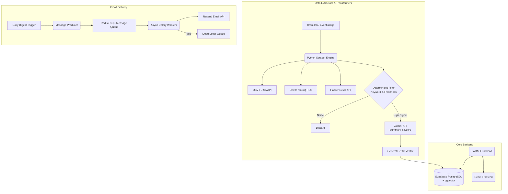

# ⚡ Signal — Engineering Intelligence Platform

An open-source, event-driven **Engineering Intelligence Platform** that filters technical noise, extracts contextual relevance using LLMs, and delivers high-signal software engineering updates in under **3 minutes a day**.

**Live Application:** https://tech-news-project.vercel.app/

## **🚀 Product Vision**

To build the ultimate automated triage engine for software engineers. Signal doesn't just list the news; it mathematically evaluates, deduplicates, and personalizes technical intelligence so engineers can stay at the cutting edge in less than 3 minutes a day.

### **🧠 The Problem**

- Tab Fatigue: Engineers waste 20+ minutes a day checking Hacker News, Dev.to, InfoQ, and OSV databases.
- Low Signal-to-Noise: 80% of tech news is PR fluff, VC funding announcements, or SEO spam.
- Redundancy: When a new framework drops, 15 different sites publish the exact same article.
- Lack of "Why": Traditional feeds provide a title and a link, but fail to answer the engineer's immediate question: "Why should I care   about this update?"

**✨ Why This is Different (The Moat)**
- Anonymous-First UX: No forced signups to read the feed. Maximum utility, zero friction.
- The "Why I Care" Layer: AI extracts exactly 3 bullet points of hardcore technical value from every article.
- Vector Deduplication: If 5 sites report on the same Redis outage, pgvector semantic clustering groups them into a single timeline       event.
- Zero-Day Fast Tracking: Critical CVEs from the OSV database bypass standard queues for instant 10/10 priority routing.
- Personalized Ranking: Opt-in authenticated users receive personalized feeds calculated via the cosine distance between the article's    vector and their custom user-profile vector.

## 🏗 Production Architecture

## 🧠 Engineering Decisions

- Deterministic Filtering Pre-LLM: Reduced API token consumption by 80% and slashed processing latency by building a local, regex-based   heuristic engine to drop non-technical noise before triggering expensive AI calls.
- Idempotent Database Writes: Engineered ingestion pipelines to be safely retriable. Database upserts rely on strict URL hashing          constraints to prevent duplicate records during network timeouts.
- Rate-Limit Resilience: Implemented exponential backoff and jitter algorithms for external API interactions (Hacker News, Gemini),       ensuring zero data loss during high-load scraping intervals.
- Semantic Search Implementation: Replaced traditional LIKE %query% SQL text searches with pgvector HNSW indexes, allowing users to       search by concept (e.g., "database scaling") rather than exact keyword matches.

## ⚙️ Tech Stack

- Backend: Python 3.13, FastAPI, Uvicorn, Pydantic
- AI/ML: Google Gemini (2.5 Flash Lite + Text-Embedding-004)
- Database: Supabase (PostgreSQL), pgvector extension
- Task Queue: Redis, Celery (for async email delivery)
- Frontend: React, Vite
- Infrastructure: GitHub Actions (CI/CD / Cron), Vercel (Frontend), Render/AWS (Backend)

## **🤝 Contribution Guide**

We welcome contributions from backend engineers, data scientists, and UI/UX designers.
- Fork the repository.
- Create a feature branch (git checkout -b feature/AmazingFeature).
- Commit your changes (git commit -m 'feat: add some AmazingFeature').
- Push to the branch (git push origin feature/AmazingFeature).
- Open a Pull Request.
- For major architectural changes, please open an issue first to discuss what you would like to change.
